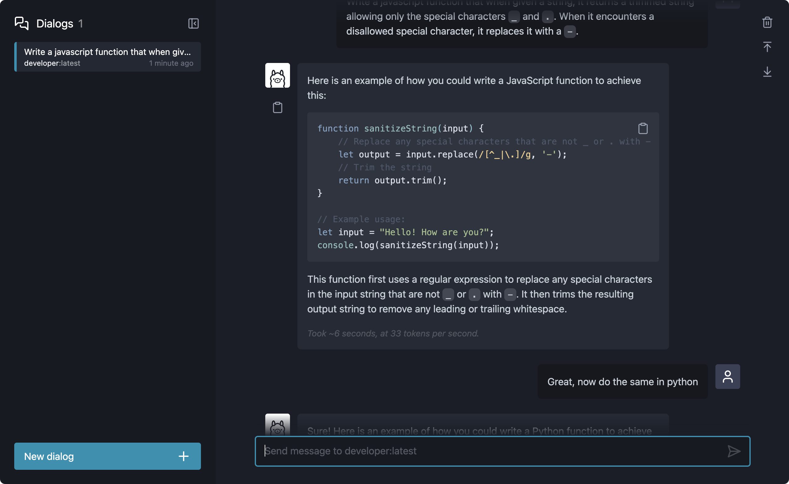

# Chat-Ollama

> Chat with your [Ollama](https://ollama.ai) models, locally

Chat-Ollama is a local chat app for your Ollama models in a web browser. With multiple dialogs and message formatting support, you can easily communicate with your ollama models without using the CLI.



## Usage

To use chat-ollama _without_ building from source:

```shell
# First, clone and move into the repo.
$ git clone https://github.com/jonathandale/chat-ollama
$ cd chat-ollama
```

```shell
# Then, serve bundled app from /dist
$ yarn serve
# Visit http://localhost:1420
```
_NB_: If you don't want to install [serve](https://github.com/vercel/serve), consider an [alternative](https://gist.github.com/willurd/5720255).

## Development

Chat-Ollama is built with [ClojureScript](https://clojurescript.org/), using [Shadow CLJS](https://github.com/thheller/shadow-cljs) for building and [Helix](https://github.com/lilactown/helix) for rendering views. Global state management is handled by [Refx](https://github.com/ferdinand-beyer/refx) (a [re-frame](https://github.com/day8/re-frame) for Helix). Tailwind is used for css.

### Requirements

- node.js (v6.0.0+, most recent version preferred)
- npm (comes bundled with node.js) or yarn
- Java SDK (Version 11+, Latest LTS Version recommended)

### Installation

With [yarn](https://yarnpkg.com/en/):

```shell
$ yarn install
```

### Development

Running in development watches source files (including css changes), and uses fast-refresh resulting in near-instant feedback.

```shell
$ yarn dev
# Visit http://localhost:1420
```
### Release

Running build compiles javascript and css to the `dist` folder.

```shell
$ yarn build
```

Serve the built app.

```shell
# Serve bundled app from /dist
$ yarn serve
# Visit http://localhost:1420
```

## License

Distributed under the MIT License.
Copyright © 2023 Jonathan Dale
